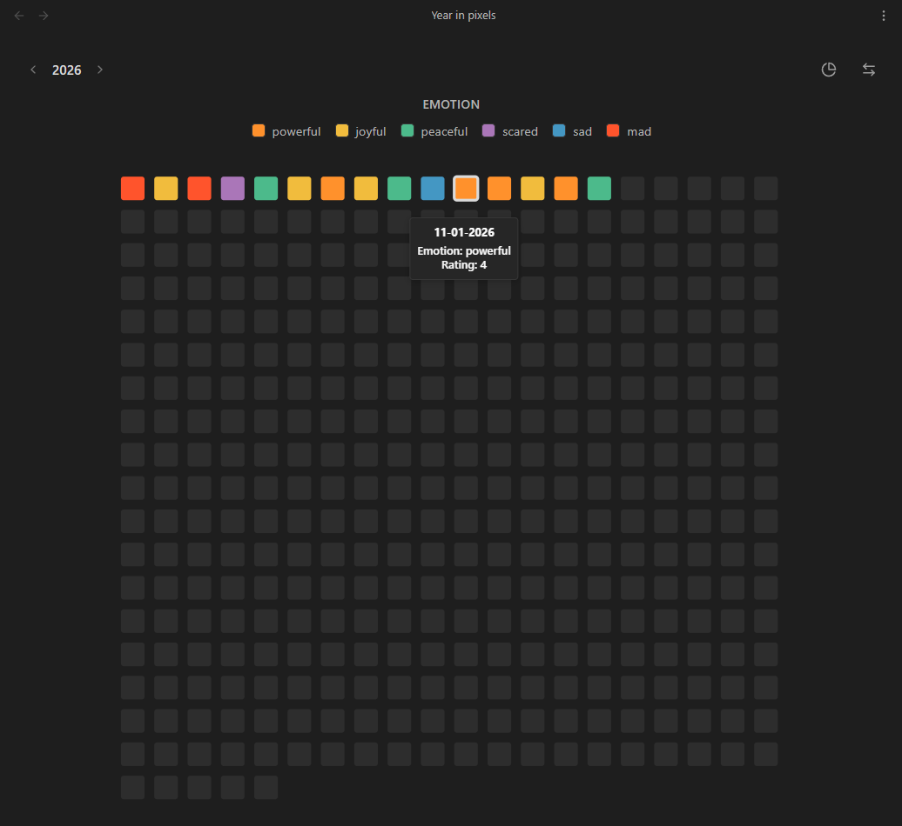

# Obsidian Year in Pixels

A visual tracking plugin for Obsidian. Year in Pixels reads the frontmatter of your daily notes and generates grid and circular charts to visualize your tracked variables throughout the year.



## Features

- **Chart layouts**: View your records as a standard horizontal grid or alternative circular layouts
- **Custom variables tracking**: Tracks user-defined properties from your daily notes frontmatter
- **Custom date formats**: Supports notes formatted as `YYYY-MM-DD`, `DD-MM-YYYY` and other standard layouts in titles or frontmatter
- **Color configuration**: Maps frontmatter values to user-defined hex colors
- **Dual view modes**: Available as a main workspace tab or a compact sidebar view
- **Interactive interactions**: Hover to view the exact date and logged variables, or click to open the corresponding note

## How it Works

The plugin looks for notes in a specified target folder (e.g., `Journal/2026`). It expects the note titles or a `date` property to contain a valid date according to your chosen format.

To track data, add the variables to your YAML frontmatter:

```yaml
---
date: 2026-05-14
emotion: joyful
rating: 5
energy: high
---
```

## Usage

- Use the **grid icon** in the left ribbon to open the main Year in Pixels view
- Open the Command Palette (`Ctrl/Cmd + P`) to access:
    - `Open Year in Pixels`: Opens the main visualization tab
    - `Open Year in Pixels (Sidebar)`: Opens the compact visualization in the right sidebar

## Settings

- **Target folder**: The folder containing your daily notes or journal entries
- **Date format**: The format used in your note titles or frontmatter dates
- **Years**: The specific years to visualize
- **Data & examples**: Generates sample notes to automatically configure and preview the charts
- **Custom variables**: Defines the frontmatter keys to track, their display names, and the specific color mapping for each possible value
